<style>
  strong { color: orange !important; }
  video::-webkit-media-controls { will-change: transform; }
</style>

# <!-- fit --> 10 CURIOSIDADES

# <!-- fit --> SOBRE MIM

Lucas de Lima | <del>37</del> 38 anos (1986)

---

# 🙂🙃🙂

# <!-- fit --> 2 IRMÃOS

mais novos

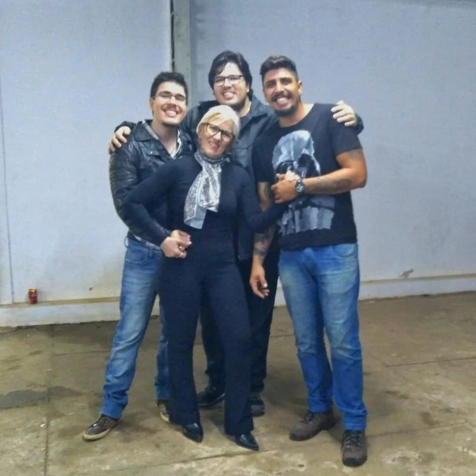

---

0 Bonecos

# 2 sobrinhos

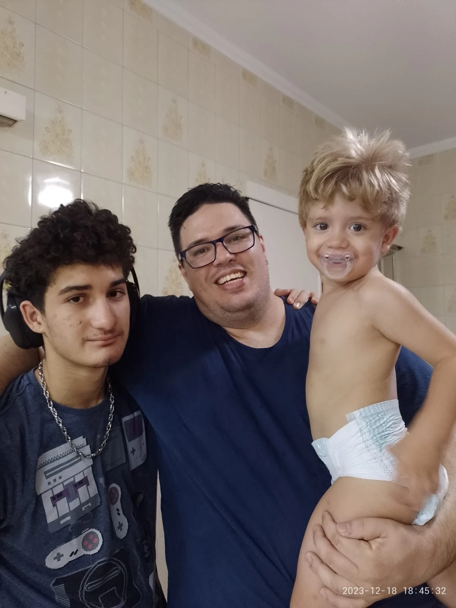

# 👨‍👦‍👦

---

<!-- _class: invert -->

# <!-- fit --> 4 cachorros

🐶🐶🐶🐶

---


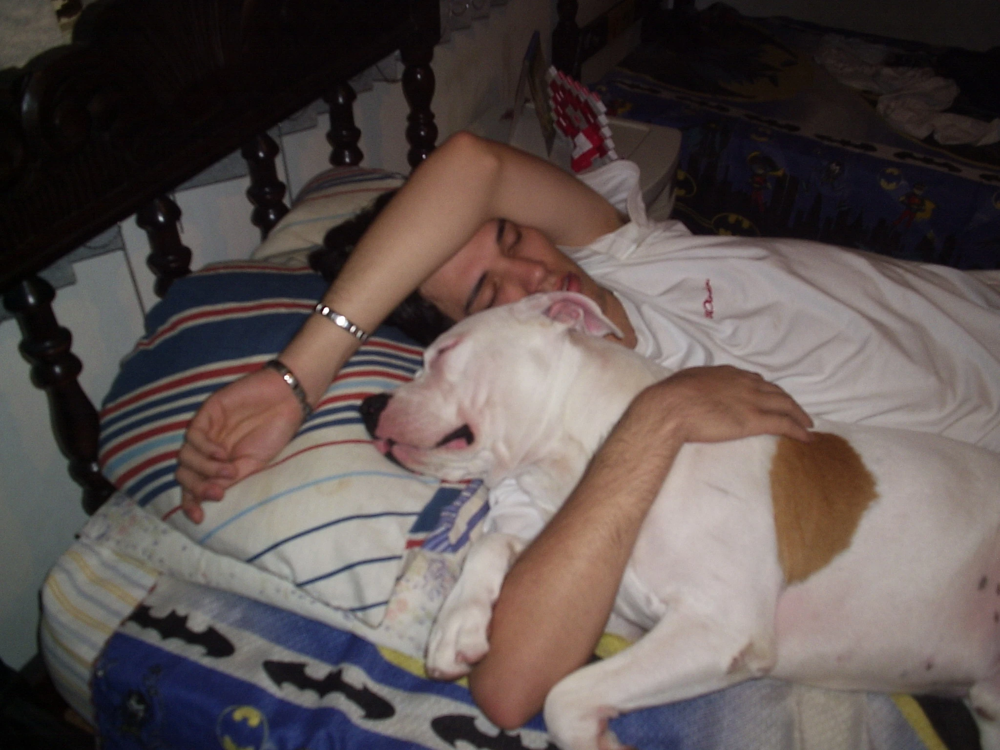

---

# <!--fit--> e...

---

<!-- _class: invert -->

## Meu nome quase foi

# <!-- fit -->_Katiuska_

---

## **- 01-**

# <!-- fit --> :fire: **BURNOUT**

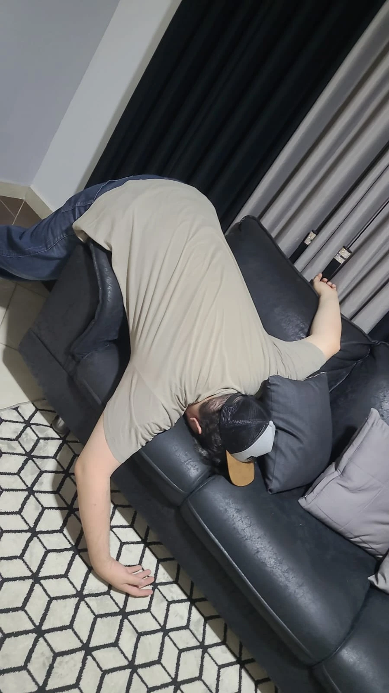

---

## - 02 -

# <!-- fit -->Aula de dança

# :dancers:

---

<!-- _class: invert -->


---

<!-- _class: invert -->

## - 03 -

# Eu já fui coder

:computer:

- markdown
- html / css / javascript
- php
- python
- ahk

---

```markdown
<!-- _class: invert -->
<style>
  ul>li:nth-child(odd) { color: silver !important; }
</style>

## - 03 -

# Eu já fui coder

:computer:

- markdown
- html / css / javascript
- php
- python
- ahk
```

---

<!-- _class: invert -->

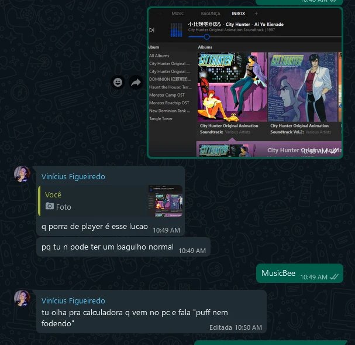

---

## - 04 -

# Comercial papelaria MEC

# :tv:

---

<video src="img/04-mec.mp4" controls width="100%"></video>

---

<!-- _class: invert -->

## - 05 -

# Já participei do canal de jogos do meu irmão.

<small>yt/bitbugado</small>

# :video_game:


---

<!-- _class: invert -->

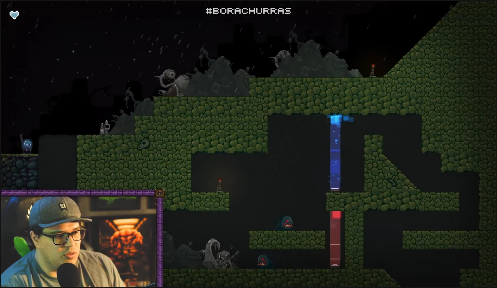
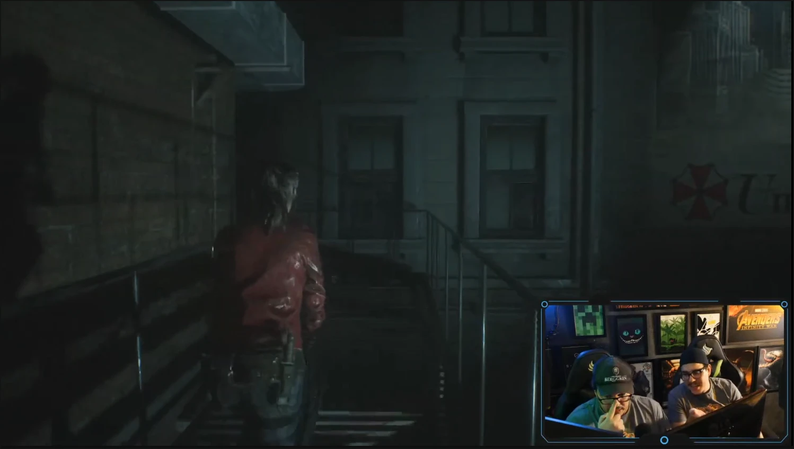

---

<!-- _class: invert -->

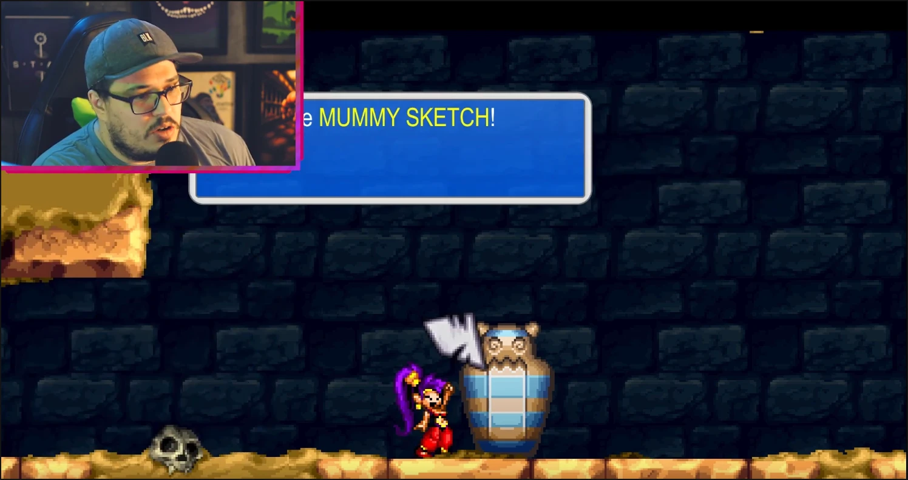

---

<!-- _class: invert -->

<video src="img/05-piadoca.mp4" controls width="100%"></video>

---

<!-- _class: invert -->

## - 06 -

# Já fui otaku

# :sushi: :jp:


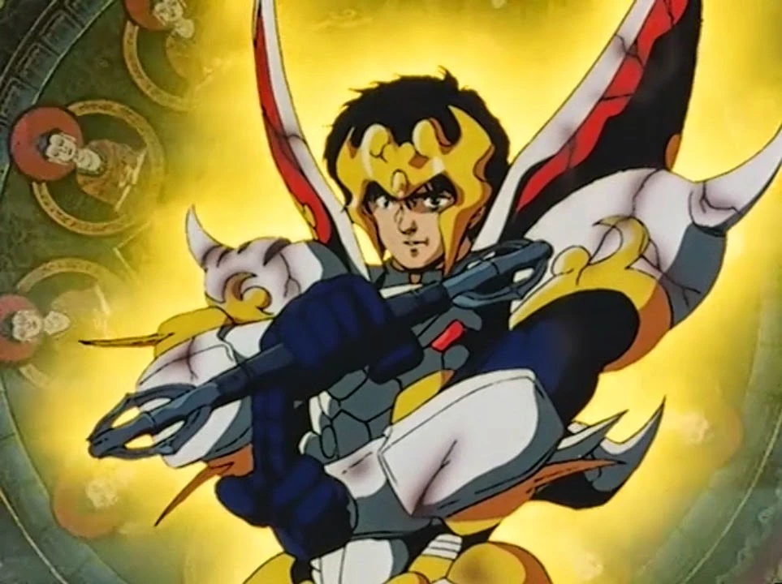
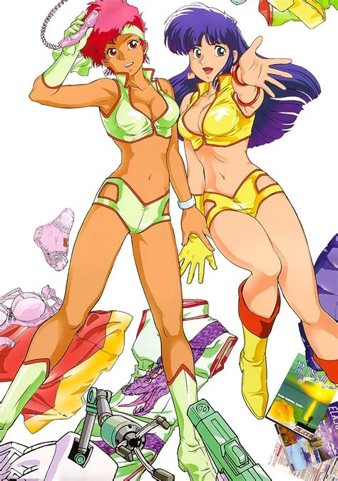

---


---


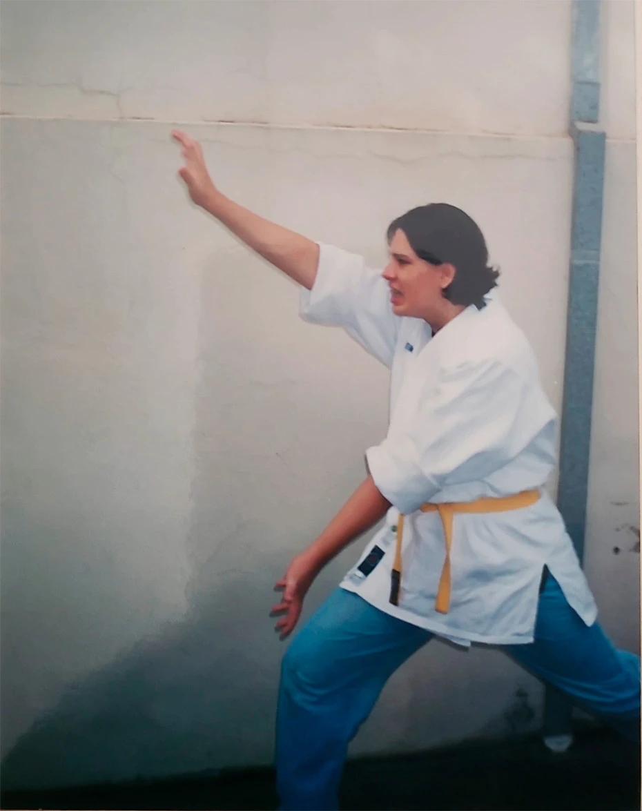

---

<!-- _class: invert -->

## - 07 -

# Só queria desenhar...

# :art:

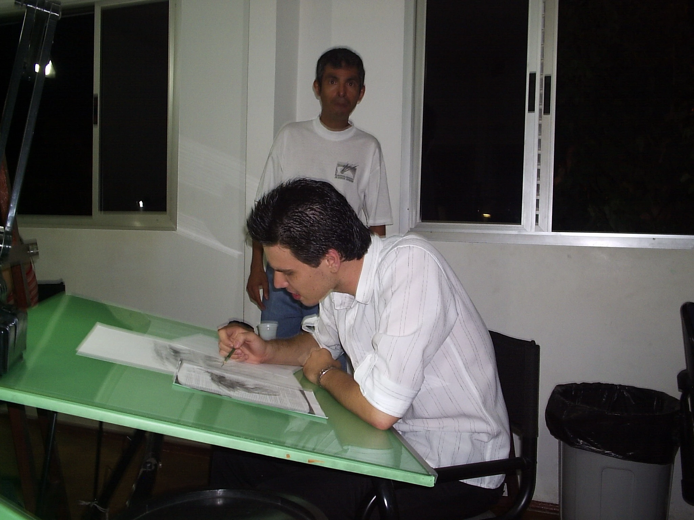

---

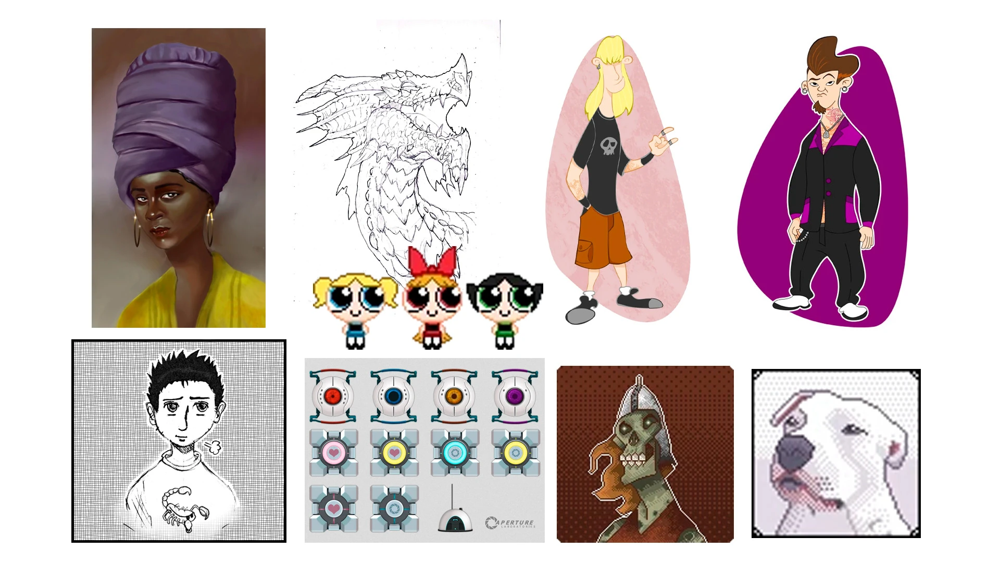

---


---

...mas deu tudo errado.

# 🤷‍♂️

---


---

<!-- _class: invert -->

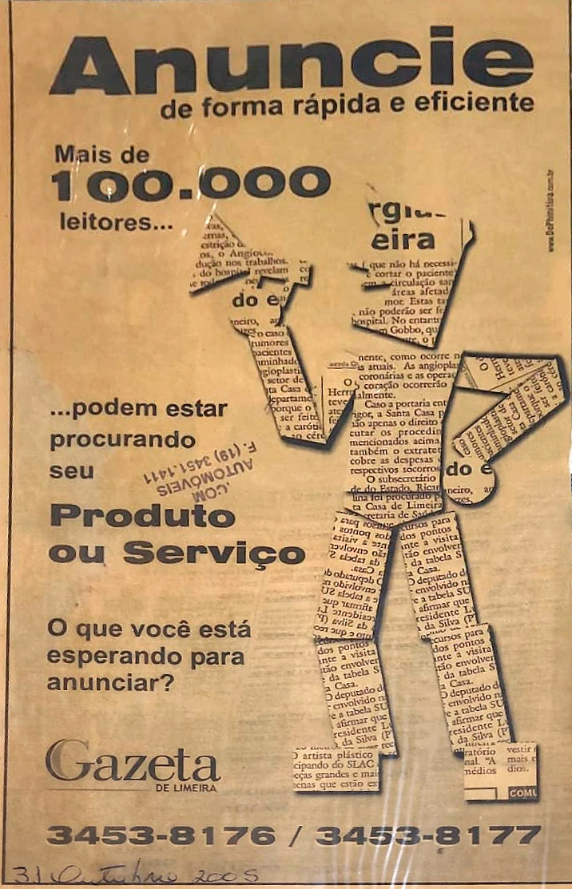

---

## - 08 -

# Fui resgatado pela<br> guarda ambiental

---

## - 09 -

### Vou do luxo ✨ ao lixo 💩

# MUITO RÁPIDO

---

## <!-- fit --> - 10 -

---

<!-- _class: invert -->

# A pomba, o ventilador e o pote de água

# :skull:

---

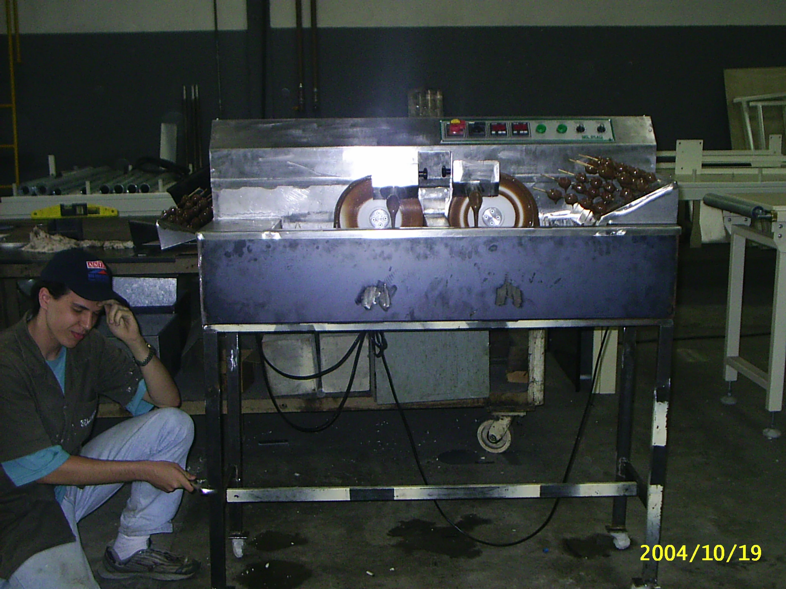

---

# <!-- fit -->Fim

Valeu! :v:

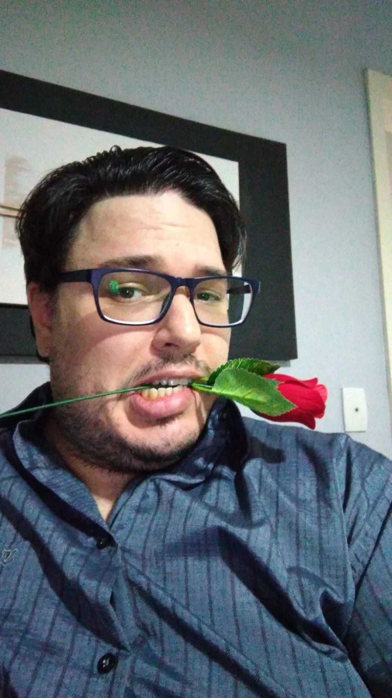
